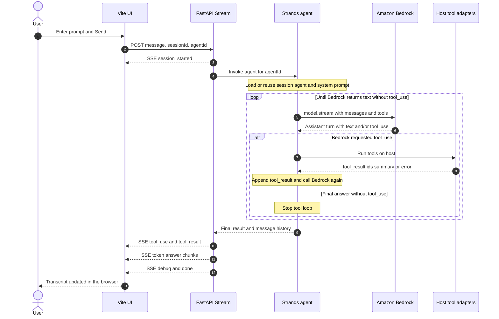
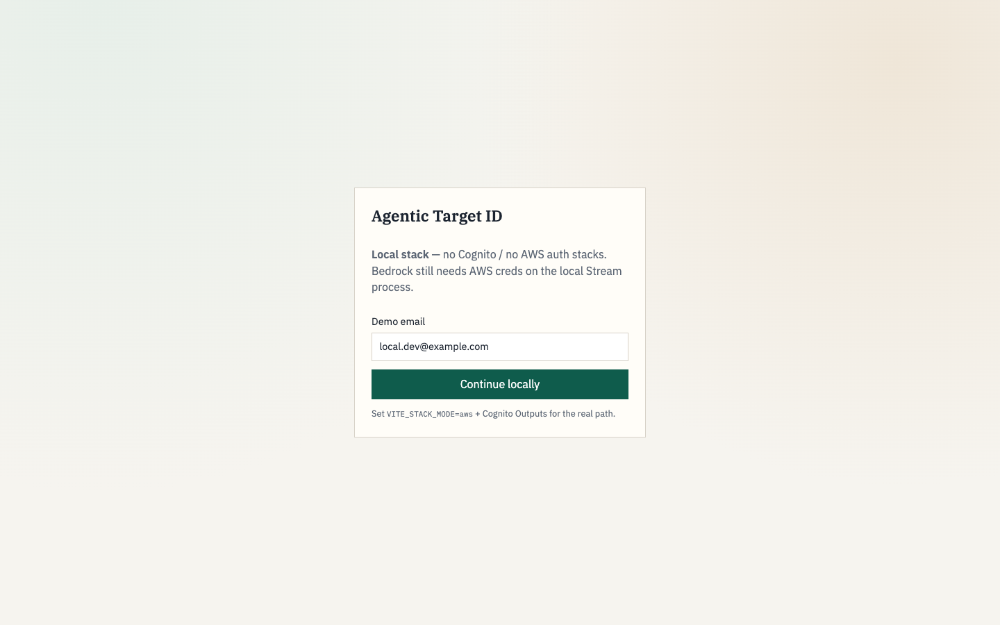
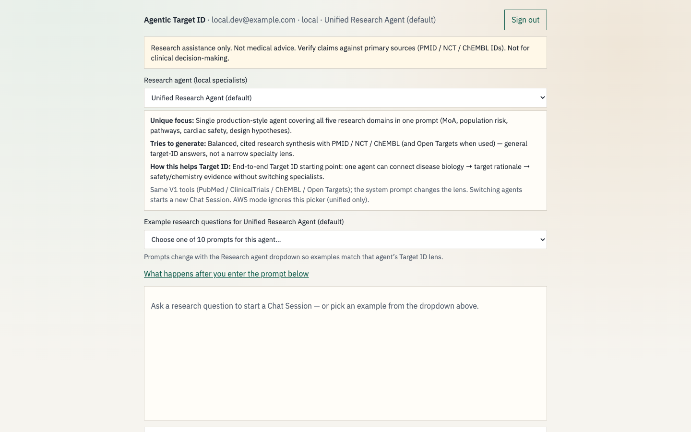

# Agentic Target ID

**Agentic AI** research-assist pilot for early **drug-discovery target identification**, built with **BMAD Method** specs and **AWS Bedrock AgentCore**.

Scientists chat in natural language. A single **Unified Research Agent** plans tool use, streams live `tool_use` / answer events, and cites public source IDs (PMID / NCT / ChEMBL; optional Ensembl via Open Targets)—without the browser ever calling AgentCore directly.

> Research assistance only. **Not** medical advice, clinical decision support, or a validated-target ranking product.

**50 persona use cases:** [`USE_CASES.md`](USE_CASES.md) · **agent + App UI prompts (tables):** [`USE_CASES_Agents_AppUI.md`](USE_CASES_Agents_AppUI.md)

## Table of contents

- [Code understanding (local Stream path)](CODE_UNDERSTANDING.md)
- [Purpose of this repo](#purpose-of-this-repo)
- [Tech stack](#tech-stack)
- [Agents (what each one does)](#agents-what-each-one-does)
- [What is target identification?](#what-is-target-identification)
- [Problem](#problem)
- [Why agentic (not a chatbot wrapper)](#why-agentic-not-a-chatbot-wrapper)
- [Cloud architecture (AWS)](#cloud-architecture-aws)
- [Stream Events (live functionality)](#stream-events-live-functionality)
- [What’s shipped (V1 + beyond)](#whats-shipped-v1--beyond)
- [BMAD Method (how this repo is specified)](#bmad-method-how-this-repo-is-specified)
- [Example research turns](#example-research-turns)
- [What happens after you enter a prompt](#what-happens-after-you-enter-a-prompt)
- [Local sequence: UI → FastAPI → Bedrock → UI](#local-sequence-ui--fastapi--bedrock--ui)
- [Why so many agents? Do they have separate brains?](#why-so-many-agents-do-they-have-separate-brains)
- [Deploy (pilot)](#deploy-pilot)
- [FAQ](#faq)
- [Security](#security)
- [License](#license)
- [Acknowledgments](#acknowledgments)

## Purpose of this repo

This repo focuses on **two things at once**:

1. **Spec-driven development with AI (BMAD Method)** — plan first (brief → PRD → architecture → epics/stories), then implement against those artifacts so humans and coding agents share one contract—not ad-hoc vibe coding.
2. **Strands agents on Amazon Bedrock for Target ID** — run research agents (Strands + Claude on Bedrock) that plan tool use, look up public biomedical sources, and stream cited answers. Local day-to-day uses host FastAPI + Bedrock; demos use the full **AgentCore** AWS path (Runtime / Gateway / Memory).

Together, that replaces tab-hopping across PubMed, trials, and chemistry DBs with a governed, evidence-backed chat workflow—while also serving as a BMAD mastery / reference build.

**What it is trying to resolve**

| Pain today | What this pilot does |
| --- | --- |
| Evidence for MoA, trials, chemistry, and target genetics is scattered | One chat session plans tool use across PubMed, ClinicalTrials.gov, ChEMBL, and (optional) Open Targets |
| “Black box” LLM answers with no live tool trail | Stream Events (`tool_use` / `tool_result` / `token` / `done`) so scientists see what was looked up |
| Browser talking directly to privileged agent runtimes | Cognito → SigV4 Stream Lambda → AgentCore (AD-1); browser never holds Runtime IAM |
| Unclear local vs cloud experiment paths | Local host Stream for cheap day-to-day work; AWS path for demos; **production stays one Unified agent** |

**In scope:** research assistance with cited public IDs, multi-turn Chat Sessions, governed Gateway tools, BMAD planning artifacts.  
**Out of scope:** medical advice, clinical decision support, validated-target ranking, multi-agent cloud swarms.

## Tech stack

| Layer | Stack |
| --- | --- |
| **LLM / agent runtime (AWS)** | Amazon Bedrock (Claude) · Bedrock AgentCore Runtime · AgentCore Memory · AgentCore Gateway (MCP tools) |
| **Stream bridge** | AWS Lambda Function URL (SSE) · SigV4 from Cognito Identity Pool |
| **Auth / front door** | Amazon Cognito · CloudFront + S3 (React UI) |
| **IaC / ops** | AWS CDK · CloudWatch (dashboard / alarms / X-Ray / EMF when Ops stack is on) · optional WAF |
| **Agent code** | Python 3.12 · Strands-style agents · Gateway tool adapters (PubMed / CT.gov / ChEMBL / Open Targets) |
| **Web UI** | React + Vite · Stream Events transcript |
| **Local day-to-day** | Host FastAPI Stream (`local/stream_app.py` :8787) · Vite :5173 · host AWS creds for Bedrock only · in-process tools (Gateway MCP off) |
| **Method** | BMAD Method planning + implementation artifacts (not Kiro) |

## Agents (what each one does)

**Cloud / production path:** only the **Unified Research Agent**.  
**Local UI:** specialists are the **same Bedrock model + same tools**, with a different **system prompt** (domain lens). They are for experiments and demos—not separate brains.

| Agent | Role / objective | Typical output | Target ID help |
| --- | --- | --- | --- |
| **Unified Research Agent** (default) | One production-style agent covering MoA, population risk, pathways, cardiac safety, and design hypotheses | Balanced, cited synthesis (PMID / NCT / ChEMBL; Open Targets when used) | End-to-end Target ID starting point without switching specialists |
| **Drug Profile Analysis** | MoA, molecular targets, toxicity/AE signals, high-level ADME/PK when public evidence exists | Drug/target profile brief | “Is this the right molecule/target?” — early safety/PK red flags |
| **Patient Risk Assessment** | Population stratification, biomarkers, vulnerability / AE patterns from literature and trials | Population-risk research memo (not care plans) | “Which patients / contexts matter?” for an indication bet |
| **Pathway Mapping** | Protein/pathway relationships and network hypotheses (literature-first; no dedicated pathway DB in V1) | Pathway/network framing with honest limits | “Where does this sit in disease biology?” |
| **Cardioprotection Target** | Cardiac safety / cardiotoxicity and protective-mechanism hypotheses | Cardio-oncology research note (no dosing/monitoring) | “Will this target/therapy carry cardiac risk?” |
| **Drug Design Hypothesis** | Structure/binding and optimization hypotheses grounded in ChEMBL + literature | Chemistry/design sketch (no invented PDB/docking) | “Is it druggable / how might we modulate it?” |
| **Genetic Risk Assessment** | Gene/variant context from public literature (V1 has no Ensembl/GWAS Gateway tools) | Genetics-oriented synthesis for scientists (not counseling) | “Is genetics on our side?” for the target–disease link |
| **Medical Supervisor** (local stubs) | Local experiment router across specialist domains — not a cloud multi-agent Runtime | Routed / multi-domain local exploration | Sandbox multi-angle questions; AWS still uses Unified only |

## What is target identification?

**Target identification** is a core early-stage **drug discovery** concept.

In pharmaceutical R&D, a **target** is usually a biological molecule (often a protein, gene, or pathway node) believed to be causally linked to a disease and modulable by a drug. Target identification is the work of finding and justifying that target before heavy investment in chemistry and clinical development.

Typical questions include:

- What drives the disease biology?
- Is this protein or pathway druggable?
- What happens if we inhibit or activate it (efficacy and safety)?
- Which patients benefit most?
- Are there patents, prior art, or competing approaches?

It sits early in the pipeline:

**Disease biology → Target identification → Target validation → Hit/lead discovery → Optimization → Preclinical → Clinical**

## Problem

Target identification accounts for a large share of cost and failure risk in drug development. Critical evidence is scattered across literature, clinical registries, chemistry databases, protein networks, and safety sources. This platform unifies that work into an **agentic** research workflow so scientists can ask multi-domain questions and get evidence-backed answers faster—via **AWS Bedrock AgentCore**, governed Gateway tools, and live Stream Events.

## Why agentic (not a chatbot wrapper)

| Capability | What you get |
| --- | --- |
| **Plan → act → synthesize** | Agent selects biomedical tools, reads results, answers with citations |
| **Visible tool use** | SSE Stream Events show which Gateway tools ran |
| **Governed tools** | MCP-style AgentCore Gateway; shared timeout / 429 / `status: error` contract |
| **Multi-turn memory** | Same Chat Session follow-ups keep Herceptin/HER2 context |
| **Secure cloud path** | Cognito → Identity Pool → **SigV4** Stream Lambda → Runtime (AD-1) |
| **Spec-driven** | BMAD planning + implementation artifacts (not Kiro) |

## Cloud architecture (AWS)

```text
Scientist (browser)
  → React UI (CloudFront + S3) + Cognito
  → Stream Lambda (SSE / SigV4 Function URL)
  → Bedrock AgentCore Runtime  ← Claude on Amazon Bedrock
       ├─ AgentCore Memory (in-session)
       └─ AgentCore Gateway (MCP tools)
            → PubMed · ClinicalTrials.gov · ChEMBL
            → optional Open Targets (-c enableTool4=true)
```

**Building blocks:** Bedrock + AgentCore Runtime/Gateway/Memory · Lambda Stream bridge · Cognito · CDK · CloudWatch ops (dashboard/alarms/X-Ray/EMF when Ops stack is deployed).

## Stream Events (live functionality)

The Stream Lambda emits typed SSE events the UI understands:

`session_started` → optional `reasoning` → `tool_use` / `tool_result` → `token`… → `error`? → `done`

- Browser **never** invokes AgentCore Runtime IAM credentials.
- Tool failures surface as `error` / failed `tool_result`; the session stays usable.
- Soft stall: UI/client terminals if no `done` within ~5 minutes.

## What’s shipped (V1 + beyond)

**V1 core is complete** (Epics 1–6): Cognito chat UI · Stream Events (SSE / SigV4) · Unified Research Agent on AgentCore · Memory · CDK deploy/destroy · Herceptin MoA → cardiotoxicity multi-turn demo.

### Gateway tools

| Tool | Citations | Deploy |
| --- | --- | --- |
| **pubmed** | `ids.pmid` | Default (V1) |
| **clinicaltrials** | `ids.nct` | Default (V1) |
| **chembl** | `ids.chembl` | Default (V1) |
| **opentargets** | Ensembl / Open Targets evidence | **Beyond V1** — `-c enableTool4=true` (M3.3) |

Default CDK deploy still wires the **three** V1 tools so FR-16 stays cheap/simple; turn on tool #4 when you want target-evidence depth.

### Platform maturity (also beyond V1)

Shipped slices from Epics **M1–M5** (see sprint board):

- **Evals** — golden-prompt harness ([`docs/evals.md`](docs/evals.md))
- **Ops** — CloudWatch dashboard, alarms, X-Ray, EMF ([`docs/ops.md`](docs/ops.md))
- **Security** — threat model, optional CloudFront WAF (`-c enableWaf=true`), SSO spike notes ([`docs/security.md`](docs/security.md))
- **Staging / release** — staging notes, SLO drafts, EventBridge-before-Kafka ([`docs/staging-and-release.md`](docs/staging-and-release.md))
- **Epic L** — local specialist agent CLIs for domain experiments; **cloud production path stays one Unified Research Agent**

### Still out of scope (by design)

Multi-agent cloud swarm · vector RAG (blocked) · Kafka (cancelled) · enterprise SSO (docs spike only) · clinical-grade claims · USPTO / full pathway DB suite in the Gateway.

Roadmap detail: [`roadmap-platform-maturity.md`](_bmad-output/planning-artifacts/roadmap-platform-maturity.md) · [`epics-platform-maturity.md`](_bmad-output/planning-artifacts/epics-platform-maturity.md).

## BMAD Method (how this repo is specified)

This project is a **BMAD** mastery / reference build (spec-driven), not Kiro.

| Phase | Where | Role |
| --- | --- | --- |
| Planning | [`_bmad-output/planning-artifacts/`](_bmad-output/planning-artifacts/) | Brief, PRD (+ addendum), architecture spine (AD-1…AD-15), epics |
| Implementation | [`_bmad-output/implementation-artifacts/`](_bmad-output/implementation-artifacts/) | Sprint board + per-story records |

**Kiro → BMAD map:** `requirements.md` ≈ brief+PRD · `design.md` ≈ architecture spine · `tasks.md` ≈ epics → stories.

## Example research turns

- What is the mechanism of action of Herceptin?
- Which patient populations are most vulnerable to its cardiotoxicity? *(follow-up, same session)*
- Use Open Targets to find ERBB2 / HER2 target evidence and cite Ensembl ids *(deploy with `enableTool4=true`)*
- What ChEMBL context exists for trastuzumab / HER2-targeted agents?

## What happens after you enter a prompt

Same help content as the UI popup (**What happens after you enter the prompt below**).

### Local stack

No Cognito / Stream Lambda / AgentCore Runtime. Host FastAPI Stream + Vite UI; Bedrock is still billable via host AWS credentials.

1. **Browser** — Question POSTed as JSON to Stream at `http://127.0.0.1:8787/`.
2. **Stream** — `local/stream_app.py` mints or reuses a Chat Session id and loads the UI-selected agent (`agentId`: unified or a local specialist).
3. **Research agent (Bedrock)** — Host calls **Bedrock (Claude)** (billable). Bedrock may reply with a *tool instruction* (“please run pubmed with this query”) instead of a finished answer. That is **not** Bedrock calling PubMed — it is a message back to the host.
4. **Tools are not guaranteed every turn** — The model chooses whether to ask for a lookup. Trust the transcript: `tool_result (ok)` means the host ran the tool; if there is none, the answer may be model-only knowledge.
5. **AWS credentials (Bedrock only)** — Standard chain: `AWS_*` / `AWS_PROFILE`, else `~/.aws/credentials` + `~/.aws/config`, or SSO. Used for Bedrock — not for PubMed/ChEMBL public HTTP. No Cognito Identity Pool in local mode.
6. **Where tools actually run** — On the **local host process** (in-process adapters). They HTTP-call NCBI, ChEMBL, Open Targets, CT.gov. Gateway MCP is forced off. Not executed “inside Bedrock.”
7. **SSE events** — Stream returns `session_started`, `tool_use`, `tool_result`, `token`, then `done`. The UI paints each line in the transcript.

```text
You (Vite :5173)
  → POST local Stream :8787
  → Strands agent on host
      → Bedrock: plan / answer (billable; may emit tool_use)
      → if tool_use: host adapters → PubMed/ChEMBL/OT/CT.gov
      → tool_result back into agent → Bedrock may continue
  → SSE → transcript
```

### Local sequence: UI → FastAPI → Bedrock → UI

One Send for a **single** local agent (`agentId`): Vite UI (`:5173`) → FastAPI (`local/stream_app.py` `:8787`) → Strands agent → Bedrock, with host adapters for PubMed / CT.gov / ChEMBL / Open Targets. Bedrock never calls those APIs itself; the host runs tools and calls Bedrock again until the model returns a final answer (no further `tool_use`).



### AWS demo path

Cognito → SigV4 → Stream Function URL → AgentCore (unified agent only).

1. **Browser** — Question POSTed to the Stream Function URL.
2. **Stream** — Lambda authenticates (SigV4) and opens the session (Unified only).
3. **Research agent (Bedrock)** — AgentCore + Bedrock plan/answer; tool instructions are executed in the AWS agent/runtime path (often Gateway MCP Lambdas), still separate from the Bedrock model call itself.
4. **AWS credentials** — Browser → Cognito Identity Pool → SigV4 for Stream. Bedrock runs under AWS roles, not laptop `~/.aws`.
5. **SSE events** — Same event contract as local.

```text
You (CloudFront or Vite)
  → Cognito + Identity Pool → SigV4
  → Stream Function URL
  → AgentCore + Bedrock (plan/answer)
  → tools (Gateway/adapters) if model requests them
  → SSE → transcript
```

“Streaming…” = waiting for the turn. Live IDs only when `tool_result` is `ok`. Bedrock cost applies whenever the model runs, even if no tools are called.

## Why so many agents? Do they have separate brains?

**No.** Every local agent uses the **same Bedrock model** and the **same tools** (PubMed / ClinicalTrials / ChEMBL / Open Targets). The “brain” is always Bedrock. What changes per agent is mainly the **system prompt** (domain lens: drug profile vs pathways vs cardioprotection, etc.) — not a different model or a private tool engine.

- **What the job is (not “just calling tools”):** each turn Bedrock (1) plans, (2) may emit tool instructions for the host to look things up, then (3) synthesizes the research answer. Tools only fetch; writing and reasoning are Bedrock.
- **Where tool calling stops:** there is no hard per-agent tool budget today. The loop stops when Bedrock returns a normal answer *without* another tool instruction. Broad questions can mean many Bedrock calls (and more cost).
- **Why keep specialist folders then?** Local experiments and UI demos of Target ID angles (different default framing). Production / AWS path stays **one Unified Research Agent** — not five cloud brains.
- Local UI: the Research agent dropdown only swaps that prompt lens + example questions. If two agents feel identical, their prompts are too similar — not because each has a separate intelligence. AWS mode ignores the specialist picker and always uses Unified.

## Deploy (pilot)

**Cost habit:** deploy for demos; **destroy-when-not-demoing**. Full lifecycle: [`docs/deploy.md`](docs/deploy.md).

```bash
cd infra/backend
npm install
export GATEWAY_INVOKER_ARN="$(aws sts get-caller-identity --query Arn --output text)"
npx cdk bootstrap   # once per account/region if CDKToolkit is absent
npx cdk deploy --all --require-approval never \
  -c gatewayInvokerArn="$GATEWAY_INVOKER_ARN"
# Optional: -c enableTool4=true  -c enableWaf=true  -c opsAlertEmail=you@example.com
```

Then: create Cognito user ([`docs/auth.md`](docs/auth.md)) → open `FrontendUrl` → Herceptin MoA → confirm live `tool_use` + streamed answer.

```bash
npx cdk destroy --all --force -c gatewayInvokerArn="$GATEWAY_INVOKER_ARN"
```

### Prerequisites

- AWS account with Bedrock model access for the pinned Claude model
- AWS CLI credentials · Node.js 20+ · Python 3.12+ · Docker (Runtime / Lambda bundling)

### Manual CI (not automatic)

GitHub **Actions → Manual checks → Run workflow** (`workflow_dispatch` only). Runs golden evals `--dry-run`, Python compileall, optional Open Targets adapter smoke—**never** on every push/PR.

## FAQ

### How does the UI look for this codebase?

Local stack (`VITE_STACK_MODE=local`, Vite `:5173` + FastAPI Stream `:8787`). Demo email gate (no Cognito), then the research chat with agent picker, example prompts, and help link.

**Local login**



**Research chat (after Continue locally)**



Run: `npm run local:stream-and-ui-up` → open `http://127.0.0.1:5173/`. AWS Cognito path looks similar after real sign-in (`VITE_STACK_MODE=aws`).

### What if Bedrock keeps requesting tools — can it infinite-loop?

**Yes, in principle.** This repo has **no hard per-turn tool budget**. The Strands agent loop continues as long as Bedrock returns another `toolUse` instead of a final text-only answer. Broad prompts can mean many Bedrock calls and higher cost.

Practical brakes (not a true “max tools” guard):

| Path | What eventually stops a runaway turn |
| --- | --- |
| **Local UI** | Soft stall ~5 minutes with no `done`; you can cancel/stop the browser request |
| **AWS Stream Lambda** | Function timeout (~5 minutes) ends the turn |
| **Each tool** | Wall-clock budget ≤ ~45s then `status: error` (tool does not hang forever) |

Mitigations today: keep prompts focused, watch the transcript / local `/bedrock-trace` call count, and prefer **destroy-when-not-demoing** on AWS. A hard max-tool or max-Bedrock-call cap is not implemented yet.

### How can I tell if Bedrock spend is leaking and raising my bill?

Bedrock is billed per model invocation (and tokens), including turns that only plan tools. Forgotten AWS stacks or a chatty agent loop can raise cost without an obvious UI “leak.”

**Primary habit:** `cdk destroy` when not demoing ([`docs/deploy.md`](docs/deploy.md)).

**Detection / alerts** ([`docs/ops.md`](docs/ops.md) — Spend / budget alarms):

1. **AWS Cost Explorer** — filter by service **Amazon Bedrock** (and Lambda / AgentCore if deployed); look at daily cost spikes.
2. **AWS Budgets** — monthly budget + email (example in `docs/ops.md`).
3. **Cost Anomaly Detection** — AWS Billing console for unexpected jumps.
4. **CloudWatch / Ops stack** (when deployed) — dashboards and alarms for the pilot; not a full FinOps product.
5. **Local day-to-day** — use host Stream + Vite; check `bedrockCallCount` in turn debug / `http://127.0.0.1:8787/bedrock-trace` so you see how many Bedrock calls one Send used. Local still bills Bedrock via your AWS credentials.

There is no in-app “secret Bedrock meter.” Treat Cost Explorer + budgets as the source of truth.

### What in the Bedrock response names the tool?

Tool names are **not** free-form English in the answer text. They appear as structured **content blocks** on the assistant message.

Canonical shape (Converse / Strands message content):

```json
{
  "toolUse": {
    "toolUseId": "tooluse_...",
    "name": "pubmed",
    "input": { "query": "trastuzumab mechanism of action" }
  }
}
```

| Field | Meaning |
| --- | --- |
| `toolUse.name` | Tool name Strands will run — e.g. `pubmed`, `clinicaltrials`, `chembl`, `opentargets` |
| `toolUse.toolUseId` | Correlates with the later `toolResult` |
| `toolUse.input` | Arguments for that tool |

This repo surfaces that as:

- **SSE** — `{ "type": "tool_use", "tool": "pubmed", ... }` (from `toolUse.name` in [`tool_trace.py`](agents/unified-research-agent/unified_research_agent/tool_trace.py))
- **UI transcript** — `tool_use` lines with the tool name
- **Local Bedrock trace** — kinds like `toolUse:pubmed` on `/bedrock-trace`

A final answer without tools is usually plain `text` blocks only — no `toolUse` object.

## Security


- No secrets or AWS keys in git
- Cognito + SigV4 Stream only; no browser→AgentCore Runtime invoke
- Least-privilege IAM for Stream / Runtime / tool Lambdas
- Optional CloudFront WAF: `-c enableWaf=true`

## License

[MIT](LICENSE) © 2026 Kishore Veleti

## Acknowledgments

Patterns for biomedical tool access draw on public scientific APIs and community ideas such as [Stanford Biomni](https://github.com/snap-stanford/Biomni) database tooling concepts, adapted here for an AgentCore Gateway architecture.
