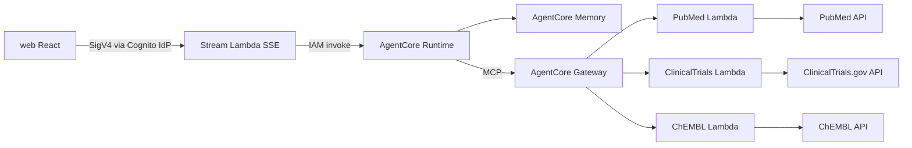
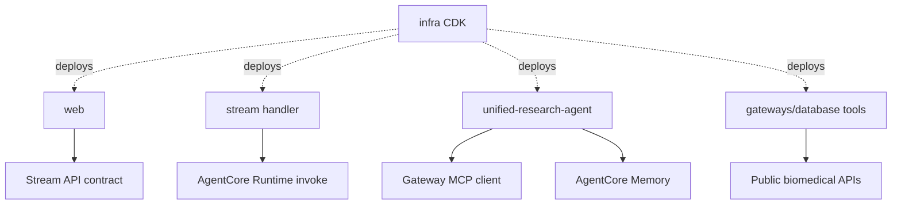
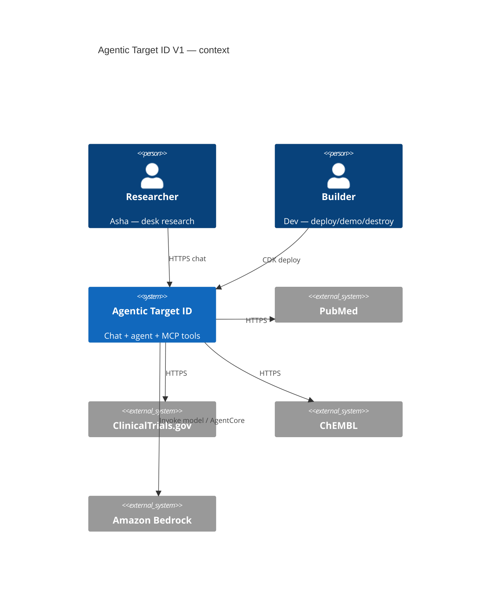

# Architecture Spine — Agentic Target ID V1

## Design Paradigm

**Layered request path + single-agent tool loop.**

| Layer | Owns | Directory |
| --- | --- | --- |
| Presentation | Chat UI, Stream Event render, Disclaimer, Cognito host UI glue | `web/` |
| Edge auth | Cognito user pool / app client | `infra/backend` (auth constructs) |
| Stream bridge | Authenticated SSE → AgentCore invoke; maps runtime stream → Stream Events | `infra/backend` + stream handler code |
| Agent runtime | Unified Research Agent (Strands + Claude on Bedrock); tool planning; synthesis | `agents/unified-research-agent/` |
| Tool gateway | AgentCore Gateway (MCP) | `infra/backend` + `gateways/database/` |
| Tool adapters | PubMed / ClinicalTrials / ChEMBL Lambda MCP targets | `gateways/database/` |
| Memory | AgentCore Memory for Chat Session turns | wired in Runtime + infra |
| IaC | CDK deploy/destroy, outputs | `infra/` |

No multi-agent swarm in V1. No browser→AgentCore Runtime direct invoke.



## Invariants & Rules

### AD-1 — Secure stream bridge only `[ADOPTED]`

- **Binds:** FR-8, NFR-1, UJ-1, `web/`, Stream Lambda, AgentCore Runtime
- **Prevents:** Browser holding Runtime credentials or calling AgentCore invoke APIs directly; web/infra picking incompatible Stream auth schemes
- **Rule:** Only the Stream Lambda Function URL invokes AgentCore Runtime. **V1 UI→Stream auth is Cognito User Pool → Cognito Identity Pool → temporary AWS credentials → SigV4-signed requests to the Function URL (IAM auth).** Browser never holds Runtime IAM or long-lived AWS creds. JWT-authorizer-on-Function-URL is Deferred (not an alternate V1 path).

### AD-2 — Single Unified Research Agent `[ADOPTED]`

- **Binds:** FR-10..FR-12, `agents/unified-research-agent/`
- **Prevents:** Parallel production agents / swarm routing in V1
- **Rule:** One agent image/runtime entrypoint plans Gateway Tool calls and synthesizes answers. Multi-agent orchestration is Deferred.

### AD-3 — Exactly three Gateway Tools `[ADOPTED]`

- **Binds:** FR-13..FR-16, SM-2, SM-C1, `gateways/database/`
- **Prevents:** Shipping README’s broader catalog as V1 acceptance
- **Rule:** Default deploy exposes MCP tools named `pubmed`, `clinicaltrials`, `chembl` only. Each is a Lambda (or Gateway Lambda target) calling the public API. Tools 4+ are Deferred.

### AD-4 — Stream Event contract `[ADOPTED]`

- **Binds:** FR-4, FR-5, FR-9, NFR-9, `web/`, Stream Lambda
- **Prevents:** Divergent event type names / UI that requires undocumented events; Stream emitting `done` before Runtime stream ends
- **Rule:** SSE payloads use types: `session_started` | `reasoning` | `token` | `tool_use` | `tool_result` | `error` | `done`. UI ignores unknown types. Soft stall: terminal UI state within **5 minutes** with no terminal event (PRD NFR-9). Stream Lambda emits `done` only after the Runtime turn stream closes (or a hard abort); `error` does not imply immediate `done` if more `token`/`tool_*` events may follow.

### AD-5 — Reasoning events are optional, never fabricated

- **Binds:** FR-4 (`reasoning`), PRD Open Q #3
- **Prevents:** Fake “thinking” text minted from answer tokens; UI hard-dependency on `reasoning`
- **Rule:** Emit `reasoning` only when AgentCore/Strands streaming exposes plan/thinking content. If unavailable, omit. UI must render when present and succeed when absent. `[ASSUMPTION: V1 may ship with zero reasoning events on the chosen Strands+AgentCore stream path]`

### AD-6 — Model ID pinned

- **Binds:** Agent runtime, Bedrock access, FR-10, PRD Open Q #1
- **Prevents:** Silent model drift across deploys / “latest in account” nondeterminism
- **Rule:** Pin Bedrock model id `us.anthropic.claude-sonnet-4-6` (US inference profile) in agent config + CDK context / Runtime env. Region default `us-east-1`. Operator must enable model access before demo. Change requires a deliberate config bump, not an ambient default. `[UPDATED 2026-07-25: original pin us.anthropic.claude-sonnet-4-20250514-v1:0 is Legacy/EOL in many accounts; active pin is Sonnet 4.6. Fallback if 4.6 unavailable: us.anthropic.claude-sonnet-4-5-20250929-v1:0]`

### AD-7 — In-session memory only `[ADOPTED]`

- **Binds:** FR-17, SM-3, AgentCore Memory, Stream Lambda
- **Prevents:** Accidental cross-day session-list product scope; Stream vs Runtime minting incompatible session keys
- **Rule:** Persist multi-turn context for one Chat Session via AgentCore Memory. **Stream Lambda owns `sessionId`** for the Chat Session: mint/return it on `session_started`, pass the same id into Runtime/Memory on every turn. No resume/list UI in V1. Logout / new browser session need not restore prior Chat Sessions.

### AD-8 — Tool failure surface

- **Binds:** FR-9, NFR-8, Stream Events
- **Prevents:** One tool timeout killing the Chat Session; ambiguous error shapes across tools
- **Rule:** On tool timeout/error: emit `tool_result` with `status: error` (plus tool name + short message), then an `error` Stream Event for that failure; still emit `done` for the turn when the agent finishes or aborts synthesis. Chat Session remains accepting new user messages.

### AD-9 — Source Identifier surfacing `[ADOPTED]`

- **Binds:** FR-11, SM-4, agent synthesis prompts, Gateway Tools
- **Prevents:** Ungrounded answers with no spot-check path when IDs exist; agent/UI parsing incompatible nested vendor JSON
- **Rule:** When tool payloads include PMID / NCT ID / ChEMBL ID, the agent answer (or adjacent citation block in the stream) must include them. Absence of IDs in tool output is not a turn failure. Each tool `tool_result` (status `ok`) MUST include a top-level `ids` object: `{ "pmid": string[], "nct": string[], "chembl": string[] }` (empty arrays when none). Agent reads `ids` only — not vendor-nested shapes.

### AD-10 — Auth: Cognito email/password, admin-provisioned `[ADOPTED]`

- **Binds:** FR-1, FR-2, UJ-2
- **Prevents:** Self-signup / Federate SSO scope creep
- **Rule:** Cognito user pool with email/password. Users created post-deploy via admin/CLI using CDK Outputs. No public self-registration UI in V1.

### AD-11 — CDK stack topology and Outputs

- **Binds:** FR-18..FR-21, SM-1, SM-5, UJ-2, `infra/`
- **Prevents:** Undocumented tribal deploy steps; orphaned billable stacks
- **Rule:** TypeScript CDK app with at least: **Backend** (Cognito User Pool + Identity Pool, Stream Lambda + IAM-auth Function URL, AgentCore Runtime, Gateway, three tool Lambdas, Memory wiring, IAM) and **Frontend** (S3 + CloudFront for `web/`). Documented Outputs must include: `FrontendUrl`, `UserPoolId`, `UserPoolClientId`, `IdentityPoolId`, `StreamUrl` (and any Runtime/Gateway ids needed to operate). `cdk destroy` tears down app stacks; docs note bootstrap/log retention leftovers.

### AD-12 — IAM least privilege + log retention

- **Binds:** NFR-3, NFR-10, NFR-12, PRD Open Q #4
- **Prevents:** `*` IAM on agent/tools; Never-expire log groups burning cost after demos
- **Rule:** Stream Lambda role: invoke Runtime + write logs only. Runtime role: Bedrock invoke (pinned model), Gateway/MCP call, Memory R/W, logs. Each tool Lambda: outbound HTTPS to its public API + logs; no cross-tool IAM. CloudWatch Logs retention **7 days** on Stream Lambda, tool Lambdas, and agent-related log groups created by the app.

### AD-13 — Dependency direction

- **Binds:** all packages
- **Prevents:** UI importing agent code; tools importing UI; circular infra/app imports
- **Rule:**



- `web` depends on HTTP/SSE contract only (not agent Python).
- Tool Lambdas depend on public APIs only (not on UI or each other).
- Agent depends on Gateway MCP + Memory + Bedrock model — not on Cognito directly.
- CDK may depend on asset paths; application code must not import CDK stacks.

### AD-14 — Data boundary `[ADOPTED]`

- **Binds:** §9.2 PRD, Disclaimer FR-6, FR-12
- **Prevents:** PHI ingestion; clinical-decision framing in architecture
- **Rule:** Public biomedical APIs only. No patient record stores. UI must show the approved research-assist Disclaimer. Agent system/developer prompt MUST include equivalent constraints (research assistance only; not medical advice; not for clinical decision-making; verify primary sources). Demo answers must not prescribe patient-specific treatment/dosing as actionable clinical orders.

### AD-15 — Tool public-API resilience

- **Binds:** Gateway Tools, addendum §D, FR-9
- **Prevents:** Tools ignoring 429/timeouts differently; silent hang vs AD-8 path
- **Rule:** Each tool Lambda retries/backs off on HTTP 429; on timeout or unrecoverable error returns `tool_result` `status: error` (AD-8). Soft per-tool timeout budget **≤ 45s** wall clock before erroring. No shared global rate-limiter service in V1.

## Consistency Conventions

| Concern | Convention |
| --- | --- |
| Naming — tools | MCP tool names: `pubmed`, `clinicaltrials`, `chembl` (lowercase, stable) |
| Naming — Stream Events | snake_case type field: `session_started`, `tool_use`, … |
| Naming — CDK Outputs | PascalCase: `FrontendUrl`, `UserPoolId`, `UserPoolClientId`, `StreamUrl`, `IdentityPoolId` |
| Stream envelope | JSON object per SSE `data:` line: `{ "type": "<StreamEvent>", ... }` — payload fields may evolve under type; `type` is stable |
| `session_started` | Must include `sessionId` (owned by Stream Lambda per AD-7) |
| `tool_use` | Must include `tool` (name); may include `input` summary |
| `tool_result` | Must include `tool`, `status` (`ok` \| `error`), and `ids` `{ pmid, nct, chembl }` arrays (AD-9); may include truncated `summary` |
| `error` | Must include `message`; may include `code`, `tool` |
| `token` | Must include `text` (answer delta) |
| `reasoning` | Must include `text` when emitted |
| IDs | PMID numeric string; NCT as `NCT`+8 digits; ChEMBL as `CHEMBL`+digits — pass through, do not invent |
| Errors | User-visible messages are safe (no secrets/stack traces); details in CloudWatch |
| Logging | Structured JSON logs with `sessionId`, `requestId`, `tool` when applicable |
| Config env names | `BEDROCK_MODEL_ID`, `AWS_REGION`, `AGENTCORE_GATEWAY_URL`, `AGENTCORE_MEMORY_ID` (no aliases like `MEMORY_ID`) |
| Auth | Cognito User Pool + Identity Pool; UI SigV4-signs Stream Function URL (AD-1). Reject unauthenticated. |
| Region | Default `us-east-1`; override only via CDK context |

## Stack

*Seed — versions web-checked 2026-07-25; code owns pins once lockfiles exist.*

| Name | Version |
| --- | --- |
| AWS CDK (`aws-cdk-lib`) | ^2.262 (TypeScript) |
| Node.js (CDK + `web/`) | 22.x |
| Python (agent + tool Lambdas) | 3.12 |
| `strands-agents` | ^1.47 |
| Bedrock model (pinned) | `us.anthropic.claude-sonnet-4-6` |
| Amazon Bedrock AgentCore | Runtime + Gateway (MCP) + Memory — managed service APIs / CDK `aws-bedrockagentcore` constructs as available in aws-cdk-lib 2.262 |
| React + TypeScript | Vite + React 18+ TypeScript (`web/`) |
| Stream Lambda runtime | Python 3.12 |
| Hosting | S3 + CloudFront |
| Auth | Amazon Cognito User Pools + Identity Pool (SigV4 to Stream) |
| Container builds | Docker (agent Runtime image) |

## Structural Seed

```text
.
├── agents/
│   └── unified-research-agent/   # Strands agent, Dockerfile, prompts, Runtime entry
├── gateways/
│   └── database/                 # pubmed, clinicaltrials, chembl tool packages
├── infra/
│   ├── backend/                  # Cognito, stream, runtime, gateway, tools, memory, IAM
│   └── frontend/                 # S3 + CloudFront + env injection for web
├── web/                          # React chat UI
├── docs/                         # deploy/destroy/create-user/smoke-demo
└── README.md
```



**Environments:** single demo account/region (`us-east-1`). No multi-env promotion pipeline in V1. Tear down when idle.

## Capability → Architecture Map

| Capability / Area | Lives in | Governed by |
| --- | --- | --- |
| Cognito auth / admin user create | `infra/backend`, docs | AD-10, AD-11, AD-1 |
| Chat UI + Disclaimer + Stream Event render | `web/` | AD-4, AD-5, AD-14 |
| Stream Lambda bridge | stream handler + `infra/backend` | AD-1, AD-4, AD-7, AD-8, AD-12 |
| Unified Research Agent | `agents/unified-research-agent/` | AD-2, AD-6, AD-9, AD-14 |
| Session memory | AgentCore Memory + Runtime wiring | AD-7 |
| PubMed / ClinicalTrials / ChEMBL tools | `gateways/database/` + Gateway | AD-3, AD-8, AD-9, AD-15 |
| CDK deploy/destroy + Outputs | `infra/` | AD-11, AD-12 |
| Observability (basic logs) | Lambda/Runtime log groups | AD-12 |
| Herceptin demo path | agent prompts + docs smoke script | AD-9, AD-6 |

## Deferred

| Item | Why it can wait |
| --- | --- |
| Tools 4–5; Open Targets / UniProt / Reactome / USPTO | PRD non-goals; post-V1 roadmap |
| Multi-agent orchestration | After structured evidence tools |
| Federate / Midway SSO; self-signup UI | PRD non-goals |
| Cross-day session list/resume | PRD FR-17 bound |
| Heavy WAF / CI polish | Beyond slice needs |
| JWT authorizer on Stream Function URL/API | AD-1 locks SigV4+Identity Pool for V1 |
| Exact SSE reconnect/heartbeat protocol | Implement behind AD-4 types; not a cross-unit fork if types hold |
| FR-3 empty-submit / FR-7 sign-out UX details | Product acceptance in stories; no cross-unit data fork |
| NFR-5/6 demo latency budgets as hard gates | Soft demo expectations in PRD; not arch divergence |
| Vite vs other React bundler details | Stack assumption; lockfile decides |
| Model fallback automation if Sonnet 4 unavailable | Manual pin swap per AD-6 assumption |
| Full C4 component/code diagrams beyond seed | Epics/stories refine modules |
| UX visual design system | Skipped this phase per owner; thin chat UI |

## Open Assumptions (accepted 2026-07-25)

1. Sonnet 4 US inference profile enabled in operator account (AD-6); fallback path stands if blocked. **Accepted.**
2. V1 may emit no `reasoning` events (AD-5). **Accepted.**
3. `web/` uses Vite + React 18+ TypeScript. **Accepted.**
4. Stream Lambda implemented in Python 3.12. **Accepted.**
5. Gateway targets are Lambdas (AWS AgentCore Gateway common pattern), not external MCP servers. **Accepted.**
